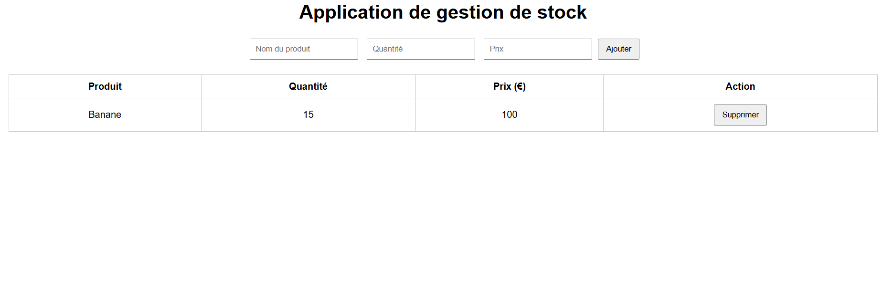

# Application de gestion de stock

Projet réalisé par **Amine Tikerouine**  
Étudiant en 3ème année Bachelor – Ingénierie Web

## Description

Application web développée en JavaScript permettant de gérer un stock de produits.

## Fonctionnalités

- Ajout de produits
- Suppression
- Gestion des quantités et prix
- Sauvegarde des données (LocalStorage)

## Technologies

- HTML
- CSS
- JavaScript

## Lancer le projet

Ouvrir le fichier `index.html` dans un navigateur.

## Capture d’écran de l’application

